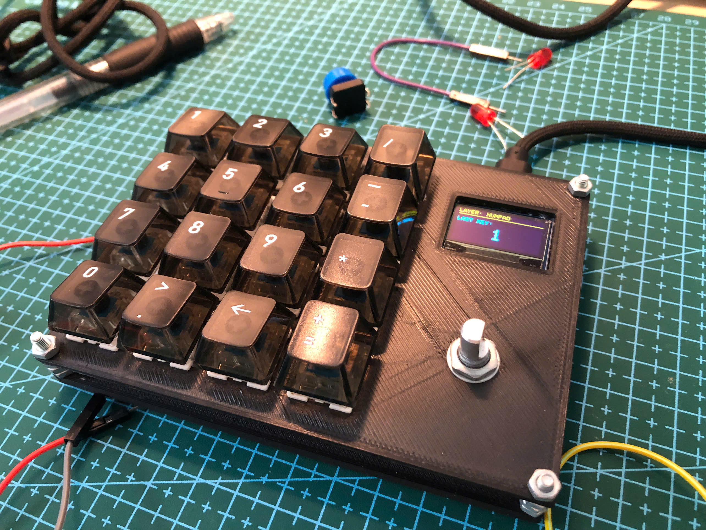
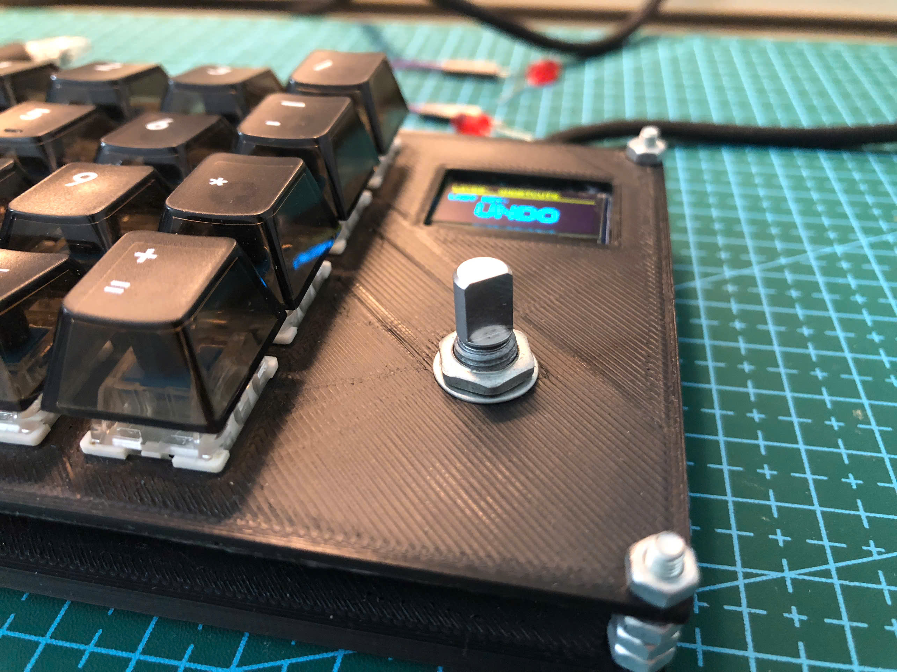
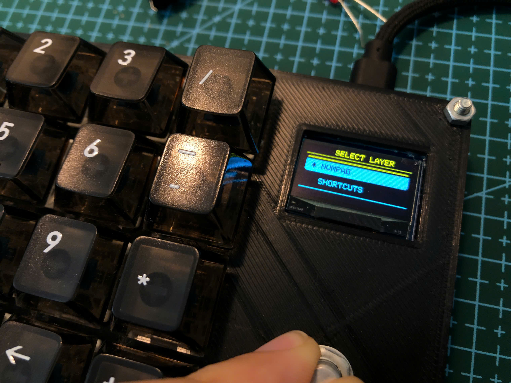
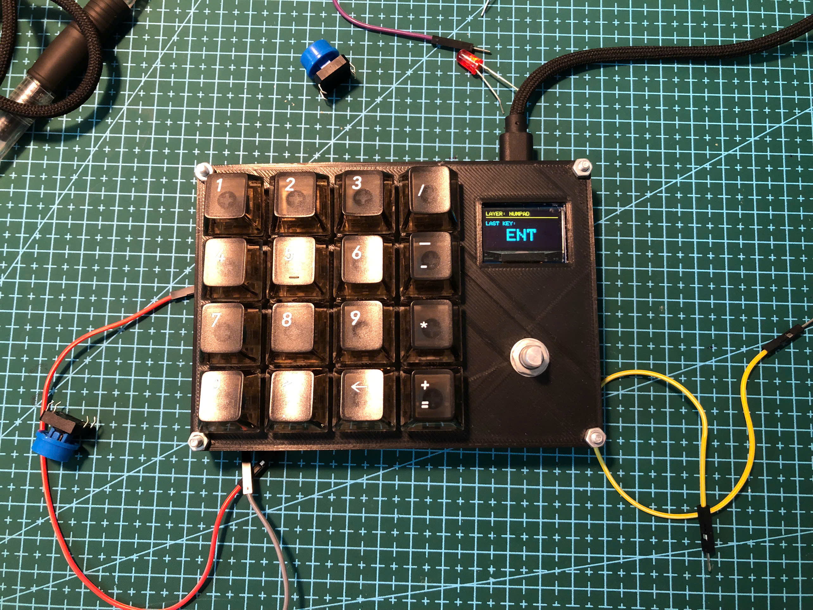
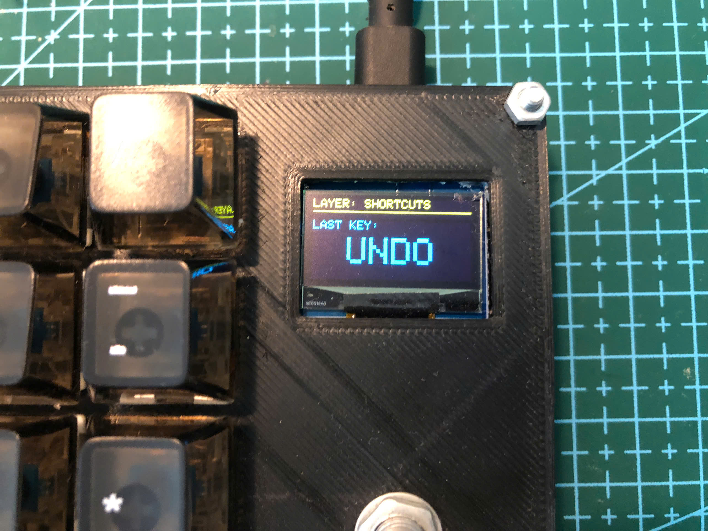

# MonkiiPad16

A sixteen key macropad with a rotary encoder and a little OLED screen. It boots as a plain number pad, and when you want something different you spin the knob to pick another layer. Right now there are two layers, a numpad and a page of editing shortcuts, with room to grow.

## The hardware

This pad runs on an RP2040 board, the same Waveshare RP2040-Zero style controller as the MonkiiPad20, and like that board it drives the OLED over the second I2C bus, which is an RP2040 feature.

The keys sit in a four by four matrix, with the rows on pins 4, 5, 6 and 7 and the columns on pins 0, 1, 2 and 3. Every key is debounced over twenty milliseconds so presses stay clean. The rotary encoder uses pins 10 and 11 for the two rotation signals and pin 8 for its push button. The screen is a 128 by 64 SSD1306 on the second I2C bus, with data on pin 14 and clock on pin 15.

## The two layers

The pad starts on the numpad layer. It is a normal number pad, digits zero through nine, a decimal point, the four maths symbols and an enter key, so you can punch in figures without reaching across your main keyboard.

Spin the encoder or press it in and a menu appears on the screen listing the layers, with the one you are on marked by a star and your current pick highlighted. Keep turning to move the highlight, then press the knob to jump to that layer. If you change your mind, just leave it alone and the menu closes itself after three seconds.

The second layer is a set of editing shortcuts, the ones you reach for all day. Undo and redo, copy and paste, save, find and select all, bold, italic and underline, comment a line, duplicate a line, and indent left or right. Each one fires the matching key combination for you, so a single tap does the work of a chord.

## The screen

While you are working the OLED keeps you posted. Across the top it shows the layer you are on, and filling the rest of the screen in big letters it shows the last key you pressed, either the digit itself on the numpad or a short label like COPY or SAVE on the shortcuts layer. When the layer menu is open the screen switches over to that instead.

## What you need to build it

The firmware uses a few libraries on top of the standard Keyboard one. You will want the Adafruit GFX library and the Adafruit SSD1306 library for the display, plus the Wire library for I2C, and all of them install straight from the Arduino library manager. If your editor marks those includes as missing before you install them, that is just the editor and not the code. Flash the sketch with an RP2040 board core selected and you are set.

## The case

The case folder holds the print ready plates, a top plate and a bottom plate. Slice and print them as they are. Take your time seating the board and the encoder so everything lines up behind the top plate before you close it up.
