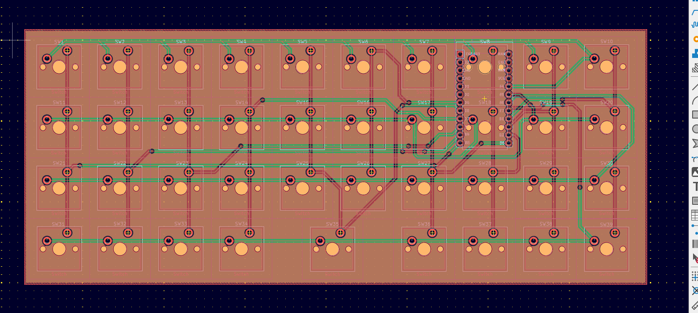
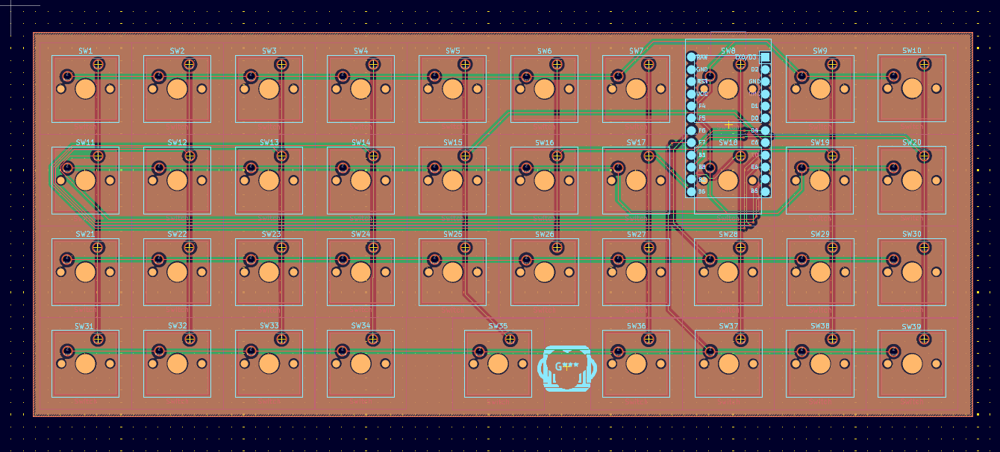
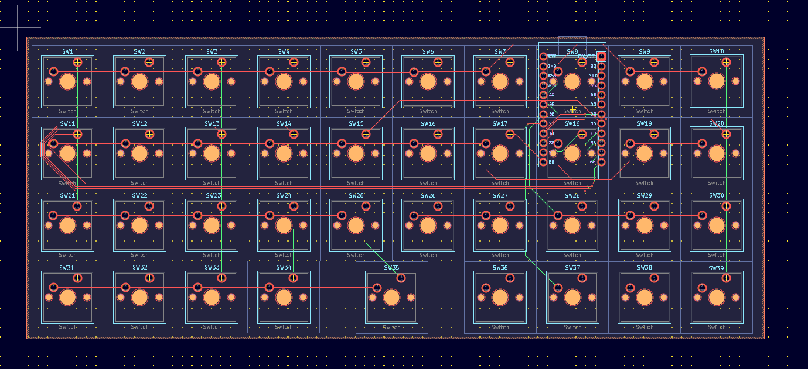
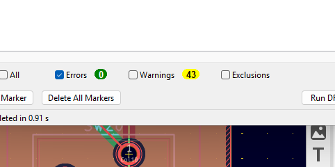
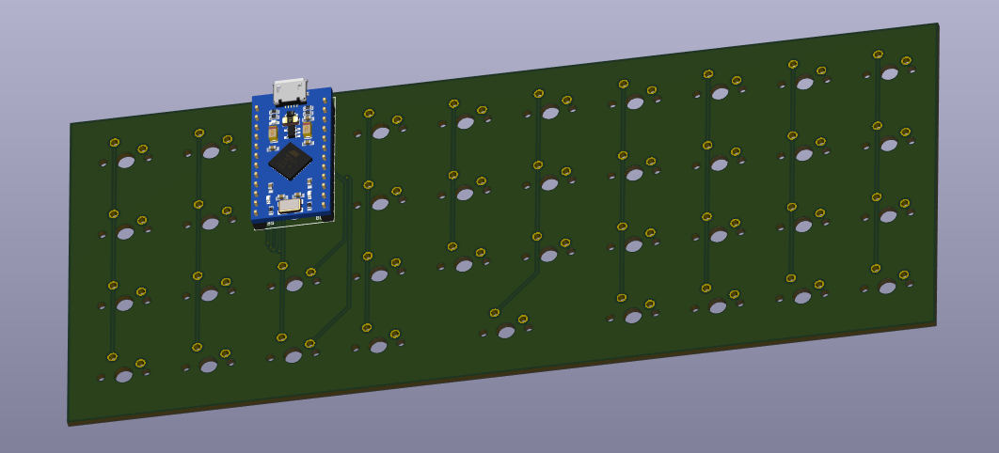

# MonkiiBoard39 PCB

This is the circuit board I designed for the MonkiiBoard39. It takes the whole thirty nine key matrix off a nest of loose wire and puts it on one board with a socket for the Pro Micro sitting right in the middle of the layout.

## How I designed it

I started from a schematic with all thirty nine switches wired straight into a four by ten matrix, no diodes anywhere, just rows and columns running into the Pro Micro.

My first attempt at placing the Pro Micro sat it too deep in the middle of the board, which crowded the traces around it and caused a pile of routing problems.

Moving it up a little and giving it more room cleared that right up.

Here is the same layout with the copper fill turned off, which makes it easier to see exactly which switch connects to which row and column.

By the end the design rule checker came back with zero errors and only silkscreen warnings left, which just means a few text labels overlap slightly and nothing electrical is wrong.

## Downloading the files

The zip in this folder has the copper layers, the silkscreen and the job file, but I have not exported the drill file yet, so pull that from the KiCad project in `KiCad_files` before you send this off to be made. Most fab houses want the drill data included alongside the gerbers, so add it to the zip or upload it as a separate file depending on what your fab asks for.

## What the board is

| Spec | Value |
| --- | --- |
| Layers | 2 |
| Thickness | 1.6 mm |
| Size | 195 by 80 mm |
| Finish | None |

Nothing unusual about the stack, so any regular fab house will take it.

## The switches

All thirty nine switches sit in a four row by ten column matrix and there is no diode anywhere on this board. I designed it that way on purpose. The firmware never asks for true rollover here since the sticky modifiers work by tapping one key and then hitting the next one after, rather than holding several keys down together, so skipping the diodes never gets in the way of a combo. You still get your control, shift, alt and the double tap windows key, they just arrive one key at a time instead of all at once.

## The pinout

Here is exactly how the matrix is wired, in case you want to check it against your own build or reroute something later.

| Signal | Pin |
| --- | --- |
| Row1 | A3 |
| Row2 | A2 |
| Row3 | A1 |
| Row4 | A0 |
| Col1 | 9 |
| Col2 | 8 |
| Col3 | 7 |
| Col4 | 6 |
| Col5 | 5 |
| Col6 | 4 |
| Col7 | 10 |
| Col8 | 16 |
| Col9 | 14 |
| Col10 | 15 |

## The controller

The Pro Micro sits in the middle of the board with its own silkscreen pin labels printed right underneath it, so you can check the columns and rows line up before you solder it down.

## Tuning your own PCB

If you want to design or tune your own version of this board, the raw KiCad project sits in `KiCad_files` right next to the gerbers. Download those three files, open the `.kicad_pro` in KiCad, and you get the schematic and the board exactly as I left them. Edit the schematic, move footprints, reroute traces, whatever your build actually needs, then export your own gerbers when you are happy with it.

## Getting it made

Send the gerbers and the drill file to whichever fab you like, two layers and 1.6 mm as above. When the boards land there are no diodes to worry about, so it is just the switches and the Pro Micro, then you are ready to flash the firmware and drop it into the case.
