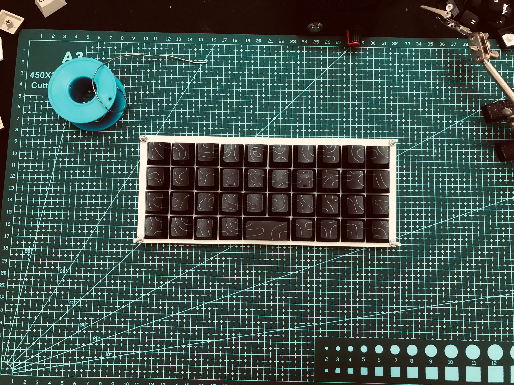
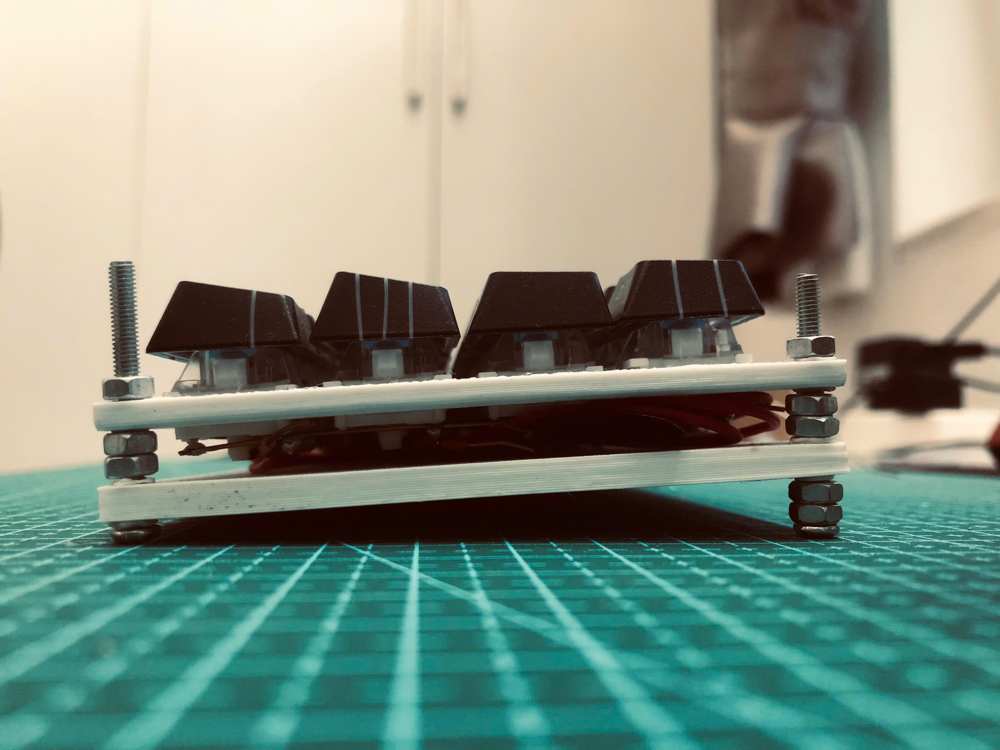

# MonkiiBoard39

The full keyboard of the family. Thirty nine keys packed into a tidy ortholinear 40 percent layout, running on a Pro Micro style ATmega32U4 board. It shows up to your computer as an ordinary USB keyboard, so there are no drivers to chase and nothing to set up on the host side.

## How it is wired

The switches sit in a grid of four rows and ten columns. The rows go to pins 2, 3, 4 and 5, and the columns go to pins 6, 7, 8, 9, A1, A0, 15, 14, 16 and 10. The firmware pulls one row low at a time and reads the columns through their internal pull up resistors, so a pressed key drags its column low and the scanner knows exactly which switch moved. There is a thirty millisecond debounce on every key so a single press only ever registers once.

This board runs without diodes. That keeps the build cheap and simple, and it is perfectly happy for everyday typing where you are hitting one or two keys at a time. Press a bunch of keys at once that happen to line up in the grid and you can get the usual ghosting any diodeless board has, so it is not the board for mashing five keys together.

## The layout

The three upper rows carry a familiar qwerty arrangement. The top row runs q across to p, the home row runs a across to l and finishes with backspace, and the lower letter row runs z through the comma and the period and finishes with enter.

The bottom row is where the fun is, and the firmware handles it by hand instead of pulling from the keymap table.

## Sticky modifiers

Control, shift and alt live on the first three keys of the bottom row, and they work as sticky modifiers. Tap one and it arms itself quietly, then the next key you press comes through with that modifier held, and the moment you let that key go the modifier clears itself again. So you can fire something like control and c without ever holding two keys down at the same time, which sits nicely with the diodeless matrix.

## The double tap Windows key

The fourth key on the bottom row is the Windows key, and it carries a little extra smarts. A single tap arms it as a sticky modifier just like the others, so you can build combos such as Windows and d. Tap it twice quickly, inside about a third of a second, and it fires the Windows key on its own to pop the start menu open.

## The spacebar

The space stretches across the middle of the bottom row as a wide 2u key. It is wired to two columns, five and six, so it registers a space no matter which side of the bar you happen to press.

## The case

The case folder holds the print ready plates for this board, a top plate that the switches clip into and a bottom plate that closes everything up. Drop them into your slicer as they are, no modelling needed. They come out nicely in PLA or PETG at around 0.2 millimeter layers with a few walls for a bit of stiffness.

## Flashing it

Open the sketch in the Arduino IDE, pick the Arduino Leonardo or SparkFun Pro Micro board and hit upload. It only needs the Keyboard library that already ships with the IDE, so there is nothing extra to install.
