# MonkiiBoard58 PCB

MonkiiBoard58 is the first board in the family that only exists as a PCB. There is no hand wired version of this one. Fifty eight switches, a rotary encoder and an OLED screen all packed onto one board, running wireless off a LiPo battery instead of a USB cable to the host.

## The layout

Fifty eight keys sit in a five row by twelve column ortholinear grid, sixty switch positions in total with two given up in the middle for the OLED window. An EC11 rotary encoder lives on the left side and a USB C receptacle sits in the top right corner for charging.

## How I designed it

I drew the matrix first, fifty eight switches each with their own 1N4148 diode, then moved on to the ESP32 S3 module, the OLED header, the encoder and the whole power section afterward.

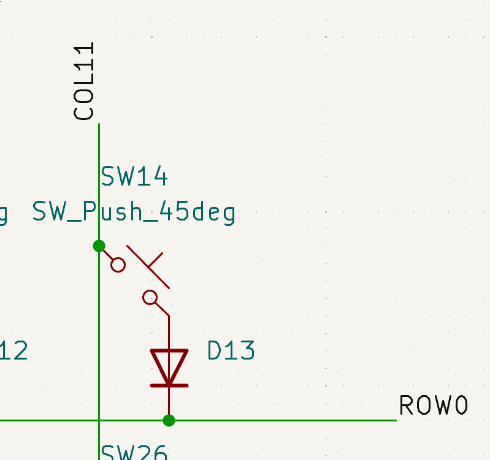

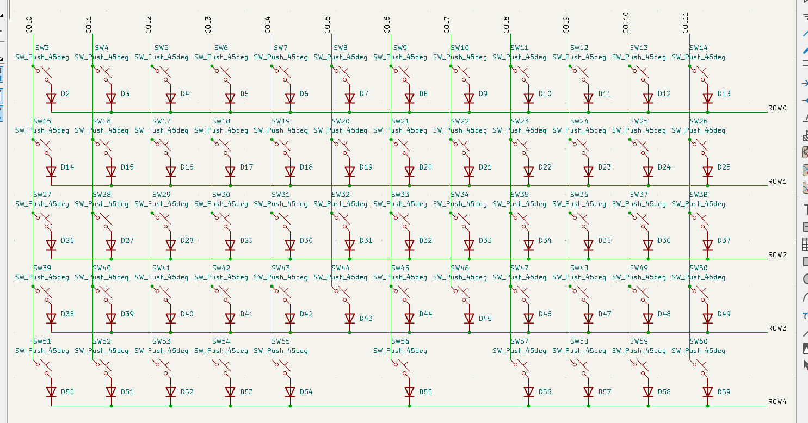

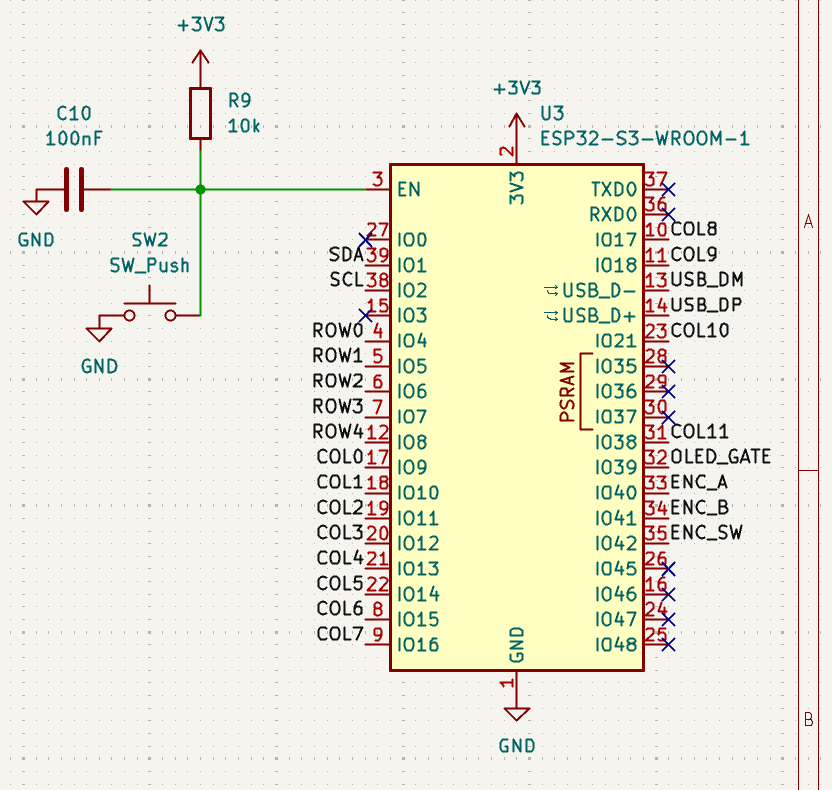

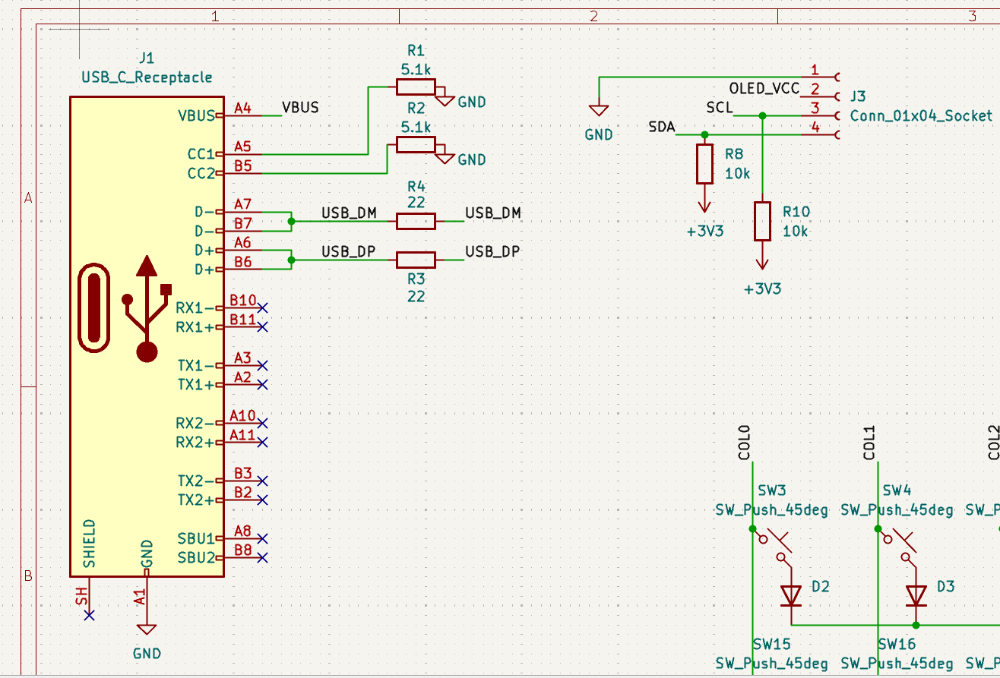

The power side got its own sheet since there was too much going on to squeeze in next to the matrix. Battery connector, power switch, the AMS1117 regulator and its capacitors all sit together here.

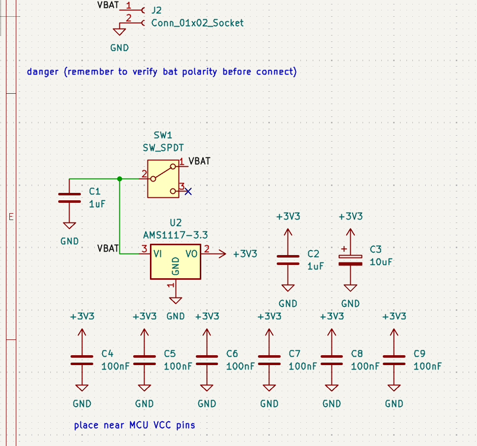

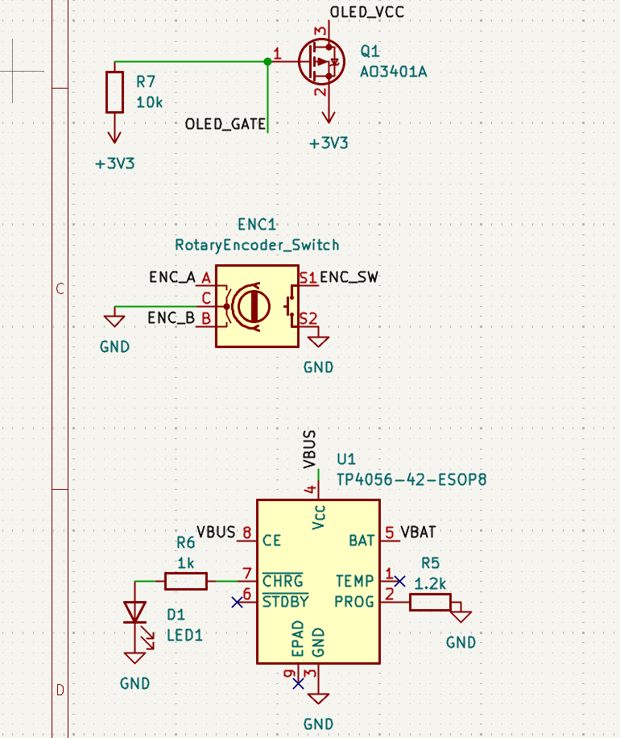

## Laying it out

The first pass at routing did not have a single mounting hole anywhere on the board, which would have left no way to actually screw it into a case later. Version two added four of them, one in each corner.

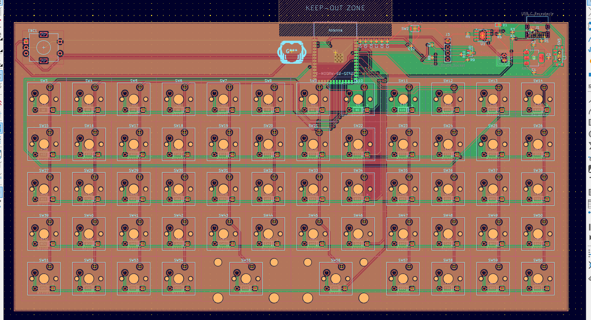

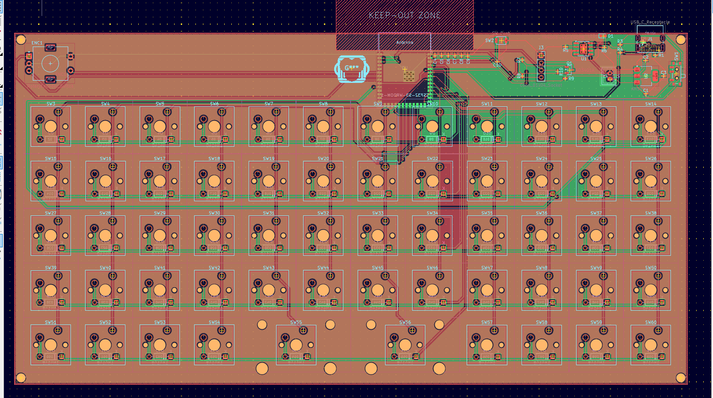

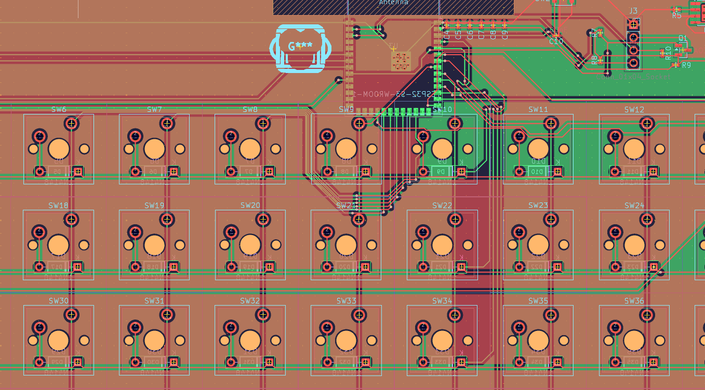

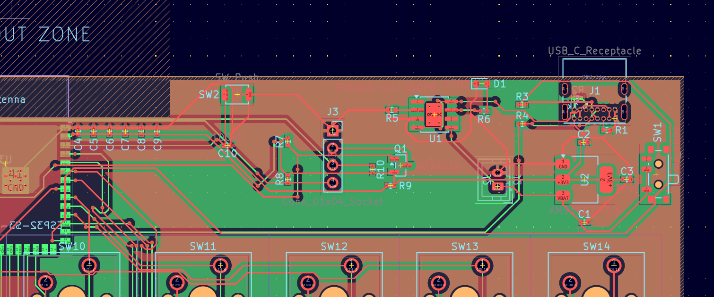

## Placing and wiring the parts

Before anything got soldered I laid every part out on the bench to check the footprints against the real components first.

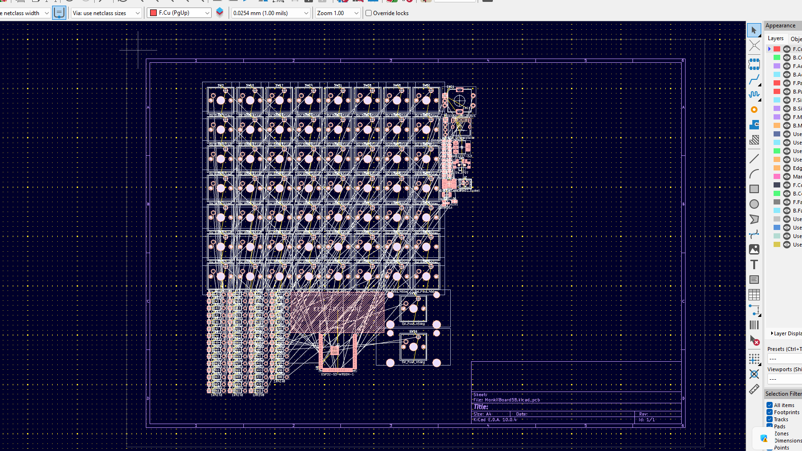

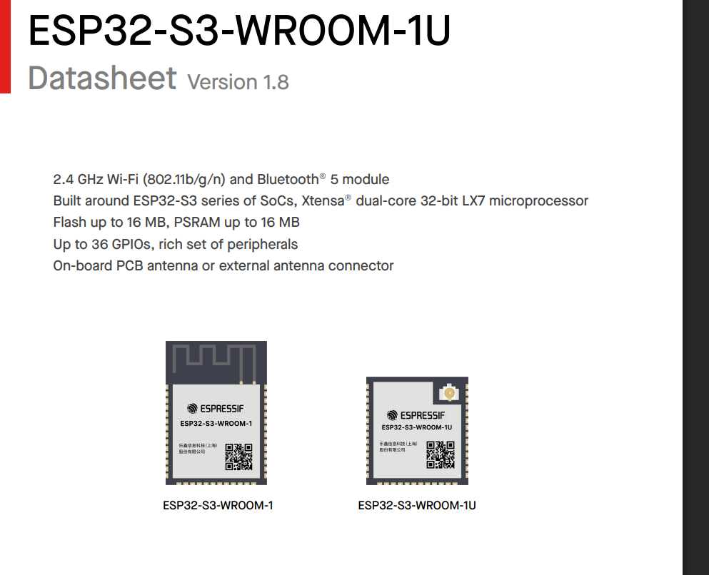

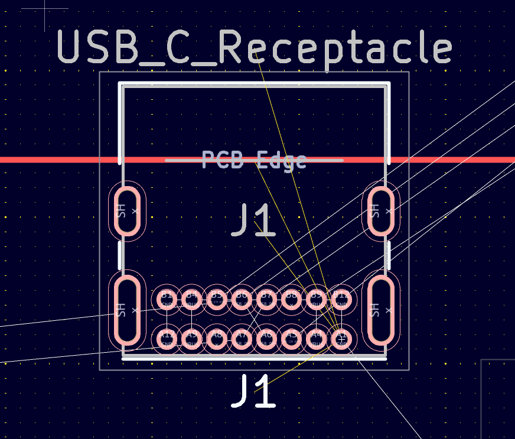

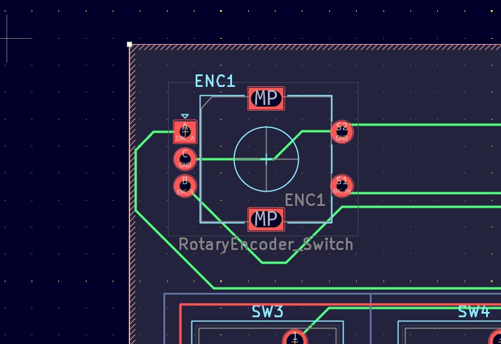

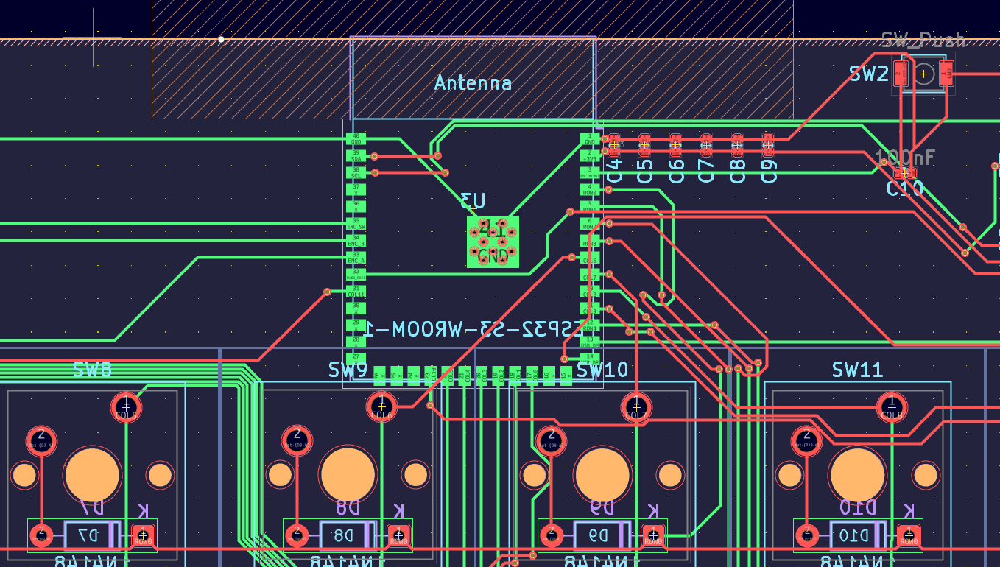

## The power system

This is the part that sets MonkiiBoard58 apart from the rest of the family. USB C brings in five volts, the TP4056 uses that to charge the LiPo battery, and everything downstream of the power switch runs off the AMS1117 regulator at a steady 3.3 volts.

| Stage | Part | Job |
| --- | --- | --- |
| Charging | TP4056 | Charges the LiPo off USB C, current set by a 1.2 kilo ohm PROG resistor, up to one amp |
| Regulation | AMS1117 3.3 | Takes the battery voltage and holds a steady 3.3 volt rail for everything else |
| OLED gating | AO3401A | P channel MOSFET that cuts power to the OLED completely when the ESP32 S3 pulls the gate high |
| Battery sensing | Resistor divider | 1 megaohm and 806 kiloohm divider scaling the 4.2 volt max battery voltage down into the ADC range |

The OLED gate is the part I am proudest of. Instead of just dimming the screen in software, the ESP32 S3 can cut its power rail entirely after thirty seconds of no key presses, so there is zero standby draw from the display while the board sits idle.

## The switches

All fifty eight switches sit in a five row by twelve column matrix, and unlike MonkiiBoard39 or MonkiiPad3x3 this one does use a diode per switch, a 1N4148 with the cathode facing the row line. With sixty positions on a wireless board meant for real typing, full rollover mattered enough to spend the extra part on every switch.

## The pinout

| Function | ESP32 S3 GPIO |
| --- | --- |
| Row 0 | GPIO4 |
| Row 1 | GPIO5 |
| Row 2 | GPIO6 |
| Row 3 | GPIO7 |
| Row 4 | GPIO8 |
| Col 0 | GPIO9 |
| Col 1 | GPIO10 |
| Col 2 | GPIO11 |
| Col 3 | GPIO12 |
| Col 4 | GPIO13 |
| Col 5 | GPIO14 |
| Col 6 | GPIO15 |
| Col 7 | GPIO16 |
| Col 8 | GPIO17 |
| Col 9 | GPIO18 |
| Col 10 | GPIO21 |
| Col 11 | GPIO38 |
| OLED SDA | GPIO1 |
| OLED SCL | GPIO2 |
| OLED power gate | GPIO39 |
| Encoder A | GPIO40 |
| Encoder B | GPIO41 |
| Encoder switch | GPIO42 |
| Battery ADC | GPIO3 |

## The controller

An ESP32 S3 WROOM 1 N16R8 sits at the top center of the board, antenna facing out toward the edge with a keep out zone underneath it so nothing on any layer sits under or around the antenna. The S3 has a native USB PHY, so the USB C lines wire straight into it with no separate USB to serial chip needed, and it talks Bluetooth 5 for the wireless side once the firmware is flashed.

## What the board is

| Spec | Value |
| --- | --- |
| Layers | 2 |
| Thickness | 1.6 mm |
| Size | 235.45 by 122.95 mm |
| Finish | None |

## Downloading the files

`MonkiiBoard58_PCB.zip` in this folder has the copper, mask, paste and silkscreen layers for both sides along with the edge cuts and the job file. There is no drill file in there yet, so pull that from the KiCad project in `KiCad_files` and add it before sending this off to a fab house.

## Tuning your own PCB

If you want to design or tune your own version of this board, the raw KiCad project sits in `KiCad_files` right next to the gerbers. Download those three files, open the `.kicad_pro` in KiCad, and you get the schematic and the board exactly as I left them. Edit the schematic, move footprints, reroute traces, whatever your build actually needs, then export your own gerbers when you are happy with it.

## Where things stand right now

This one is still ahead of the rest of the pack in age but behind everyone else in progress. The schematic and layout are done and the gerbers are ready, but I have not sent the boards off to a manufacturer yet, so nothing has actually been built or tested on real hardware. Firmware and a case are next once boards are in hand. Like every other board here it is fully open source, so the KiCad project and every file in this folder are free to build, copy or change however you like.
