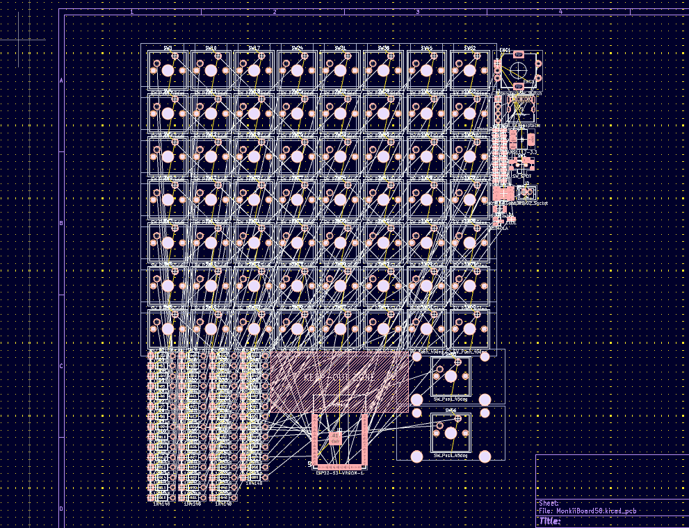
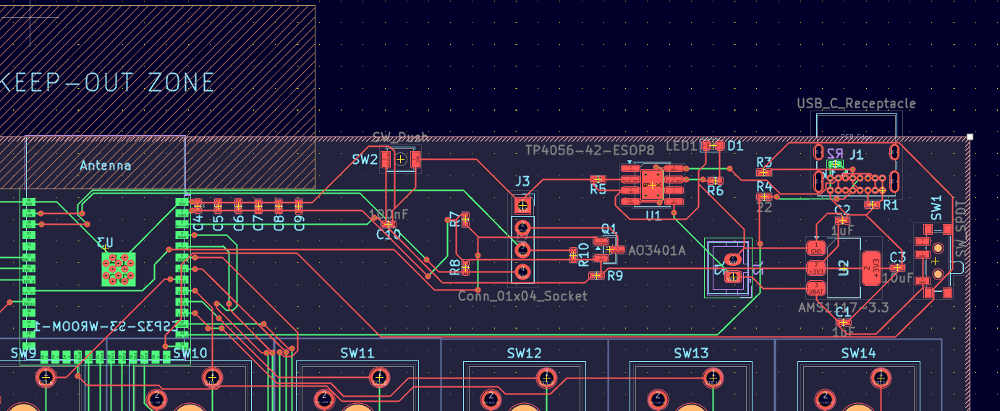
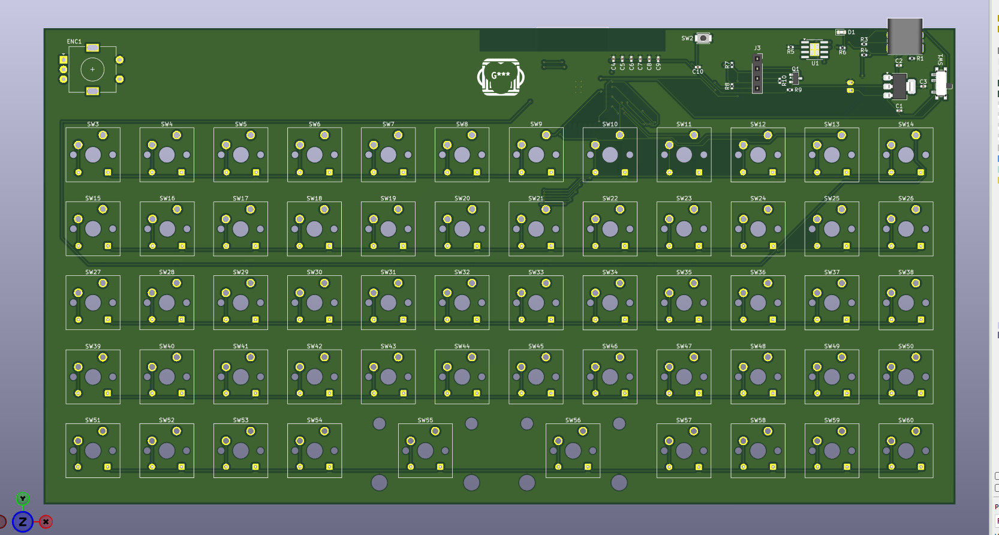
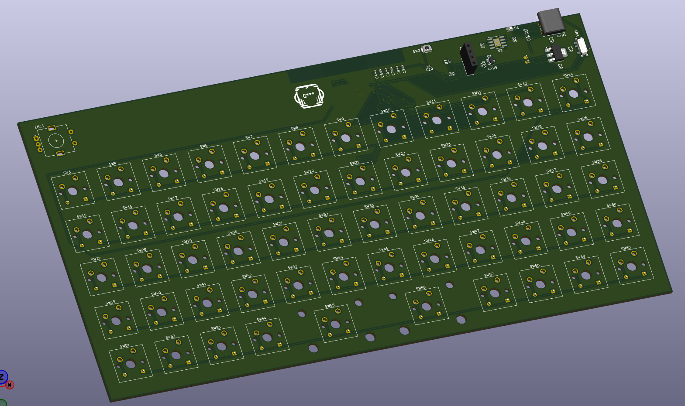
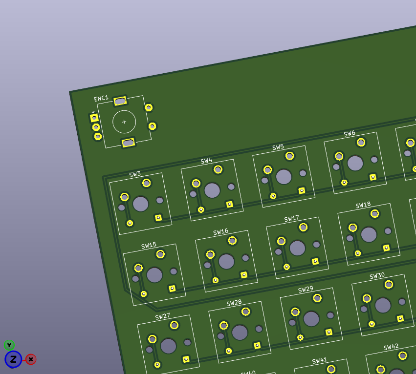
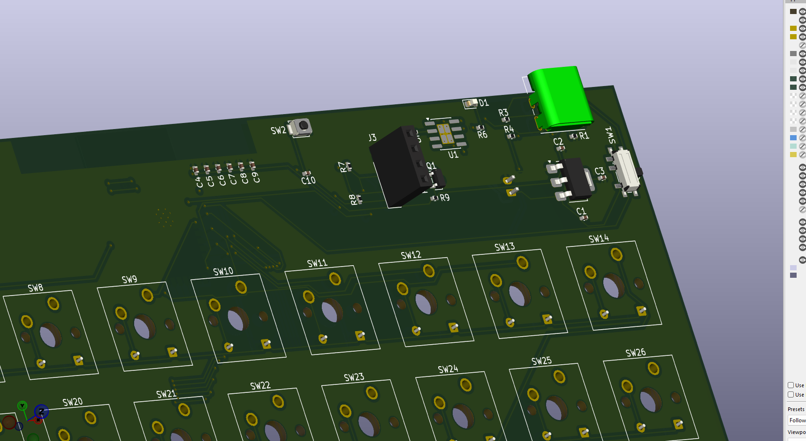
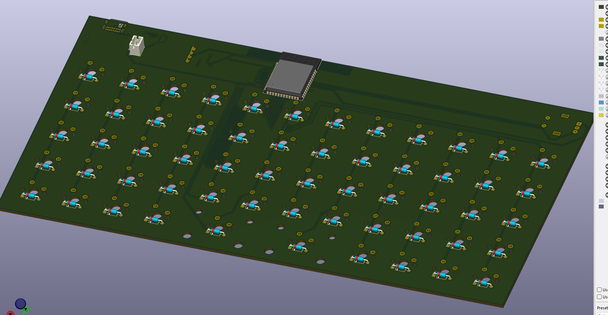
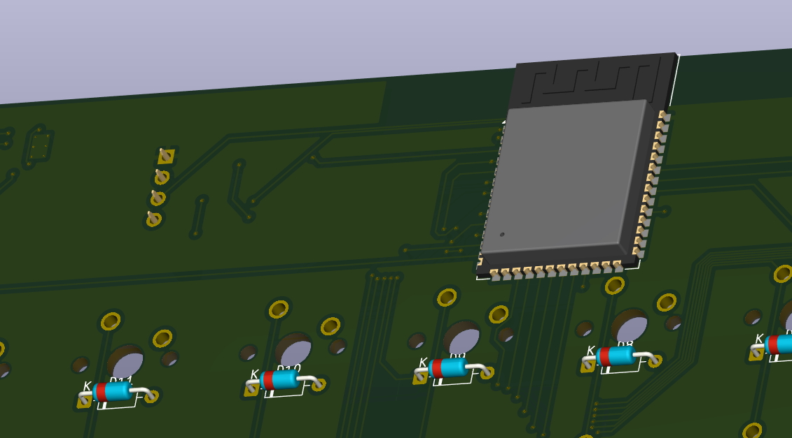
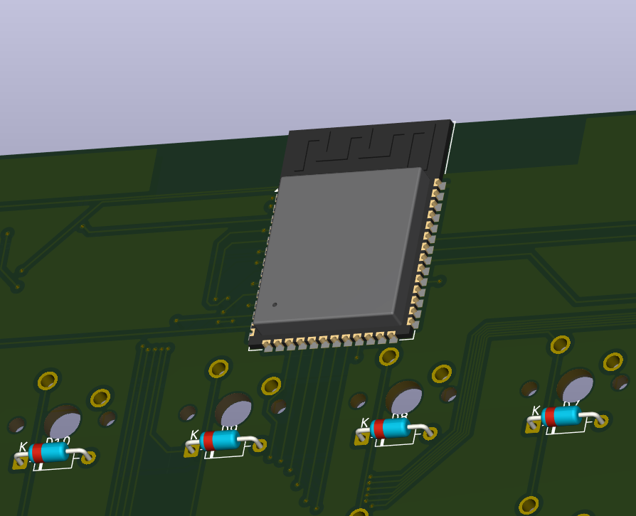
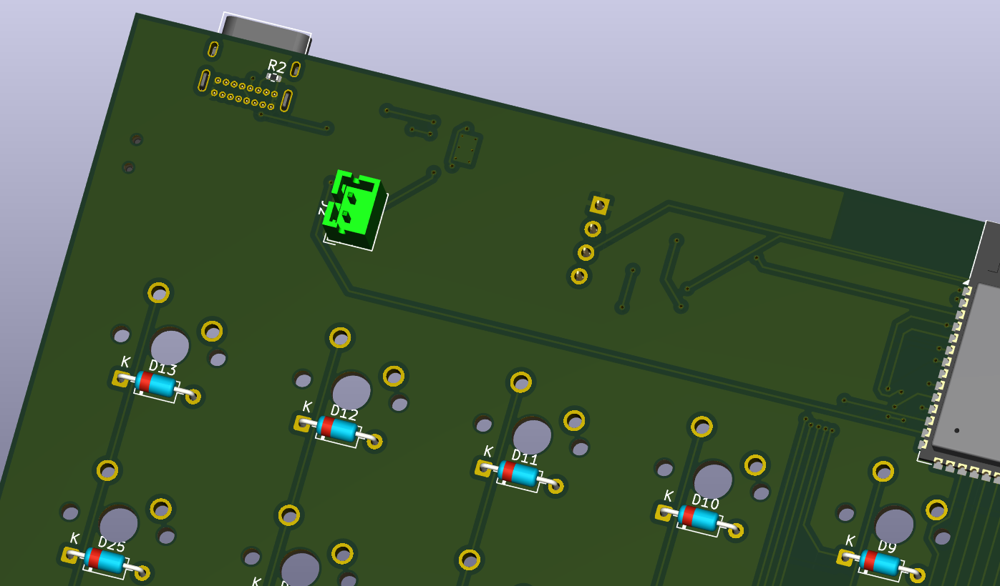

# MonkiiBoard58

Hi everyone (again haha)! This is the most ambitious board in the family of MonkiiBoard so far. Fifty eight keys in a five row by twelve column ortholinear grid, a rotary encoder on the left, and no wire to the host at all, it runs wireless off a rechargeable LiPo battery over Bluetooth (though you still plug into the USB C receptacle whenever the battery needs a charge).

## PCB only, no hand wired version

Every other board in this family gives you the choice between hand wiring the matrix or ordering the PCB. MonkiiBoard58 does not, this one only exists as a PCB. With a LiPo charger, a voltage regulator, a MOSFET power switch for the OLED and a wireless module all sharing the same board, hand wiring something like this point to point was never really on the table. The schematic and layout are finished and the gerbers are ready, but the boards have not gone off to a manufacturer yet, so this is the one board in the whole family that has not actually been built in real life. Firmware and a case are next once boards are in hand. Like every other board here it is fully open source, so every file in this repository is free to build, copy or change however you like.

## The layout

There are 58 switches fill a 5x12 (row x column) grid, with two positions given up in the middle for the OLED cutout. The encoder sits on the left and a USB C receptacle in the top right corner handles charging.

Three layers are planned for the firmware. The base layer is a standard qwerty layout, the second is navigation with the arrow keys, home, end and page up and down, and the third holds the function row and media controls. The encoder gets its own behavior per layer too, volume by default, scrolling on the navigation layer and brightness on the function layer, with a push to mute.

## The schematics

I drew the matrix first, fifty eight switches each with their own 1N4148 diode, then moved on to the ESP32 S3 module, the OLED header, the encoder and the whole power section afterward.

The power side got its own sheet since there was too much going on to squeeze in next to the matrix. Battery connector, power switch, the AMS1117 regulator and its capacitors all sit together here.

## The parts before wiring

Before anything got soldered I laid every part out on the bench to check the footprints against the real components first.

## The PCB editor, wired

The first pass at routing did not have a single mounting hole anywhere on the board, which would have left no way to actually screw it into a case later. Version two added four of them, one in each corner.

With the routing settled I went back through and wired up each section for real, checking every connection against the schematic as I went.

## The PCB, rendered

Once the routing was done I pulled it into KiCad's 3D viewer to see the actual board rather than just traces on a grid.

## The power system

This is the part that sets MonkiiBoard58 apart from the rest of the family. USB C brings in five volts, the TP4056 uses that to charge the LiPo battery, and everything downstream of the power switch runs off the AMS1117 regulator at a steady 3.3 volts.

| Stage | Part | Job |
| --- | --- | --- |
| Charging | TP4056 | Charges the LiPo off USB C, current set by a 1.2 kilo ohm PROG resistor, up to one amp |
| Regulation | AMS1117 3.3 | Takes the battery voltage and holds a steady 3.3 volt rail for everything else |
| OLED gating | AO3401A | P channel MOSFET that cuts power to the OLED completely when the ESP32 S3 pulls the gate high |
| Battery sensing | Resistor divider | 1 megaohm and 806 kiloohm divider scaling the 4.2 volt max battery voltage down into the ADC range |

The OLED gate is the part I am proudest of. Instead of just dimming the screen in software, the ESP32 S3 can cut its power rail entirely after thirty seconds of no key presses, so there is zero standby draw from the display while the board sits idle.

## The switches

All fifty eight switches get their own 1N4148 diode, cathode facing the row line, the same anti ghosting setup you would find on a wired board. This is the only board in the family besides MonkiiPad20 that uses diodes, and the only one running a full five by twelve matrix worth of them.

## The pinout

| Function | ESP32 S3 GPIO |
| --- | --- |
| Row 0 | GPIO4 |
| Row 1 | GPIO5 |
| Row 2 | GPIO6 |
| Row 3 | GPIO7 |
| Row 4 | GPIO8 |
| Col 0 | GPIO9 |
| Col 1 | GPIO10 |
| Col 2 | GPIO11 |
| Col 3 | GPIO12 |
| Col 4 | GPIO13 |
| Col 5 | GPIO14 |
| Col 6 | GPIO15 |
| Col 7 | GPIO16 |
| Col 8 | GPIO17 |
| Col 9 | GPIO18 |
| Col 10 | GPIO21 |
| Col 11 | GPIO38 |
| OLED SDA | GPIO1 |
| OLED SCL | GPIO2 |
| OLED power gate | GPIO39 |
| Encoder A | GPIO40 |
| Encoder B | GPIO41 |
| Encoder switch | GPIO42 |
| Battery ADC | GPIO3 |

## The controller

As you've noticed, there's an ESP32 S3 WROOM 1 N16R8 module sits at the top center of the board, antenna facing out toward the edge with a keep out zone underneath it so nothing on any layer sits under or around the antenna. The S3 has a native USB PHY, so the USB C lines wire straight into it with no separate USB to serial chip needed, and it talks Bluetooth 5 for the wireless side once the firmware is flashed.

## What the board is

| Spec | Value |
| --- | --- |
| Layers | 2 |
| Thickness | 1.6 mm |
| Size | 235.45 by 122.95 mm |
| Finish | None |

## Where things stand right now

The schematic, layout and 3D render are all done, but I have not sent the boards off to a manufacturer yet, so nothing shown above has actually been built or tested on real hardware. Once boards land, firmware and a case are next. Full design story, the gerbers to get one made and the raw KiCad project all live in the [PCB folder](PCB/).
