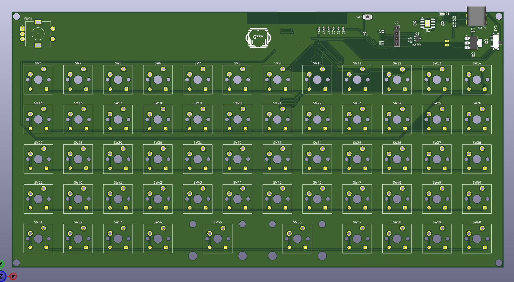
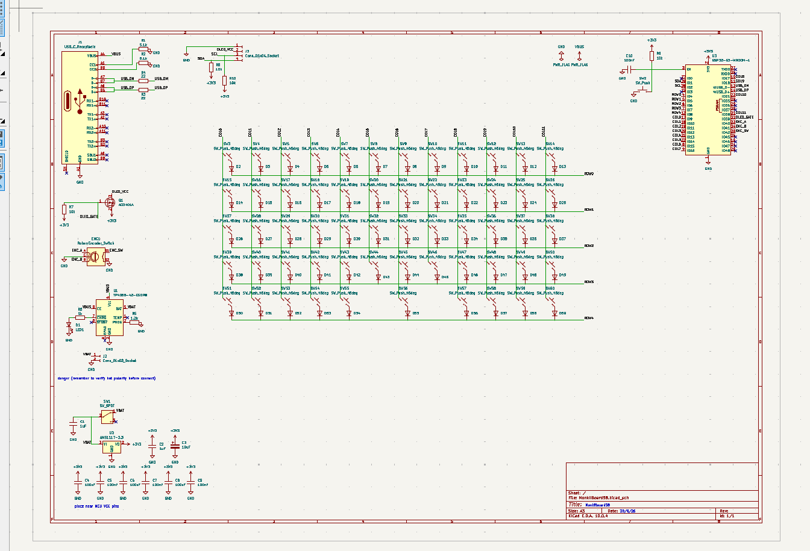
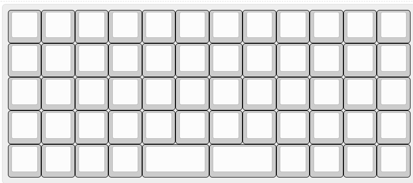

# MonkiiBoard58

The most ambitious board in the family so far. Fifty eight keys in a five row by twelve column ortholinear grid, an OLED screen built into the middle of the layout, a rotary encoder on the left and no wire to the host at all, it runs wireless off a rechargeable LiPo battery over Bluetooth.

## PCB only, no hand wired version

Every other board in this family gives you the choice between hand wiring the matrix or ordering the PCB. MonkiiBoard58 does not, this one only exists as a PCB. With a LiPo charger, a voltage regulator, a MOSFET power switch for the OLED and a wireless module all sharing the same board, hand wiring something like this point to point was never really on the table.

The full design story, every schematic sheet, the layout revisions and the files to get one made all live in the [PCB folder](PCB/).

## The layout

Fifty eight switches fill a five row by twelve column grid, with two positions given up in the middle for the OLED cutout. The encoder sits on the left and a USB C receptacle in the top right corner handles charging.

Three layers are planned for the firmware. The base layer is a standard qwerty layout, the second is navigation with the arrow keys, home, end and page up and down, and the third holds the function row and media controls. The encoder gets its own behavior per layer too, volume by default, scrolling on the navigation layer and brightness on the function layer, with a push to mute.

## The power system

Unlike the rest of the family this board carries its own battery management. A TP4056 handles charging over USB C, an AMS1117 regulates everything down to a steady 3.3 volts, and a P channel MOSFET sits between that rail and the OLED so the screen can be cut off completely rather than just dimmed when the board goes idle. A resistor divider feeds the battery voltage into an ADC pin so the firmware can track roughly how much charge is left.

## The switches

All fifty eight switches get their own 1N4148 diode, cathode facing the row line, the same anti ghosting setup you would find on a wired board. This is the only board in the family besides MonkiiPad20 that uses diodes, and the only one running a full five by twelve matrix worth of them.

## The controller

An ESP32 S3 WROOM 1 N16R8 module runs the whole board. It has a native USB PHY built in, so there is no separate USB to serial chip needed for programming, and it handles the Bluetooth 5 connection to whatever you are typing on. More on the pinout and the antenna keep out zone in the [PCB folder](PCB/).

## Where things stand right now

The schematic and PCB layout are finished and the gerbers are ready to go, but the boards have not been sent to a manufacturer yet, so none of this has been built or tested in real life. Firmware and a case are the next steps once actual boards show up. This project is fully open source like the rest of the family, so feel free to grab the KiCad files from the [PCB folder](PCB/) and build on it yourself.
