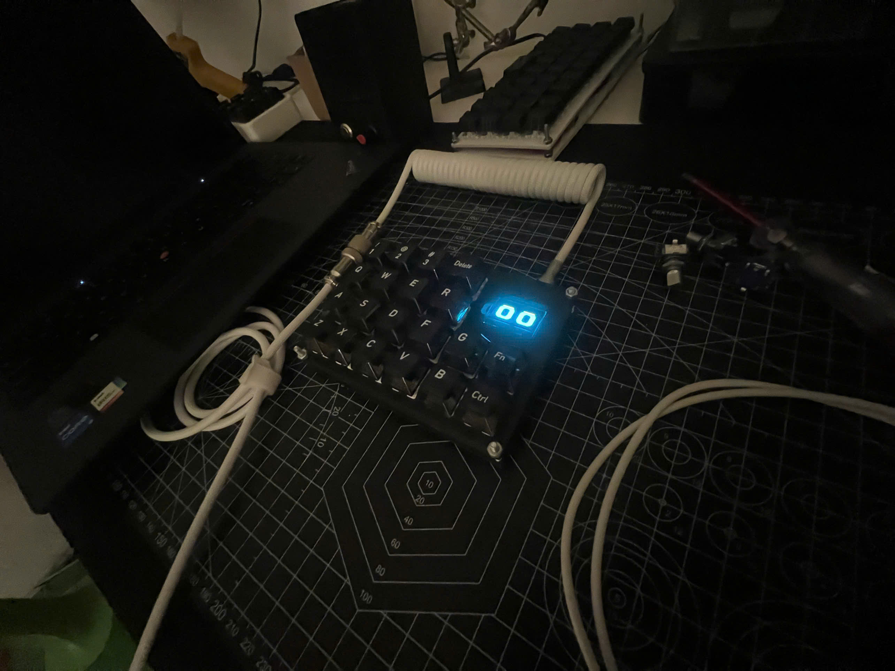
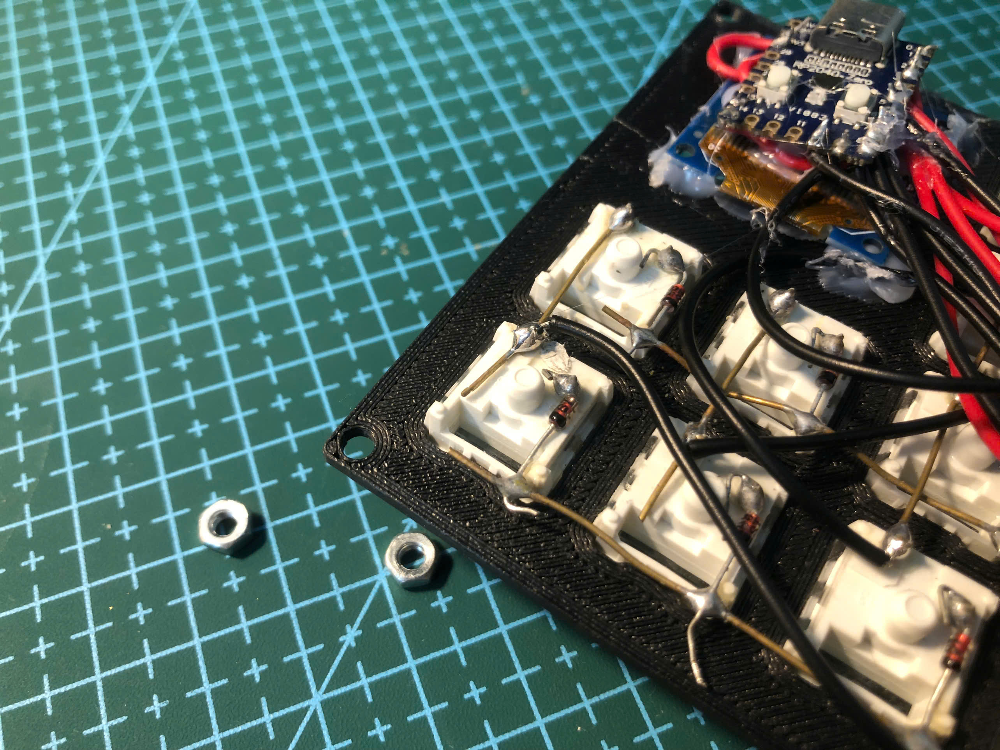
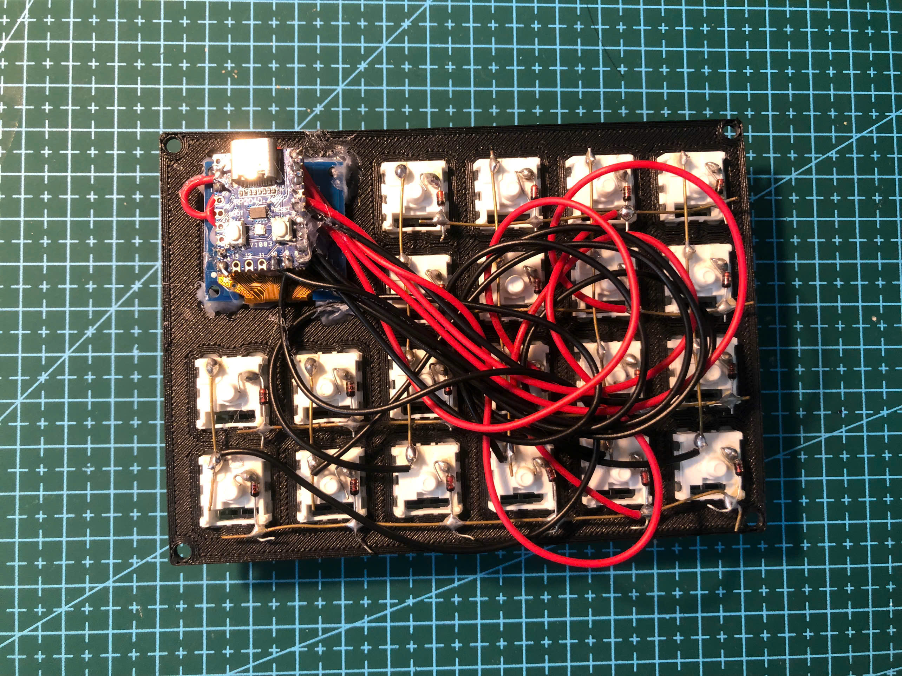
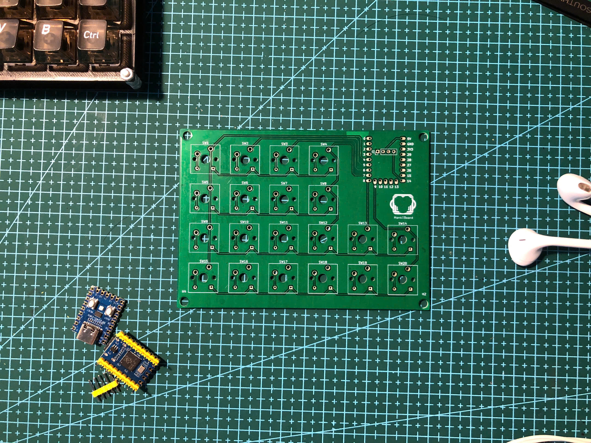
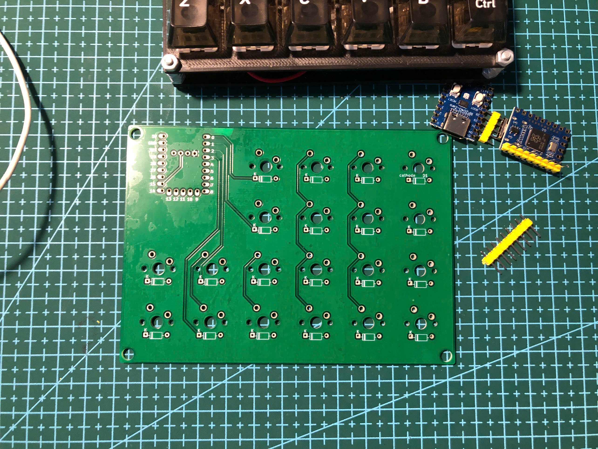
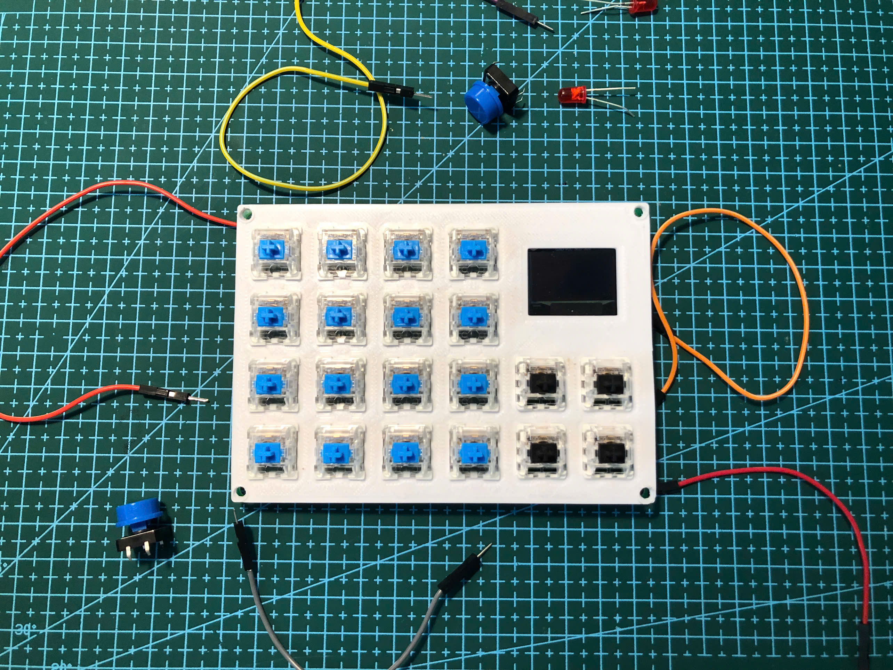
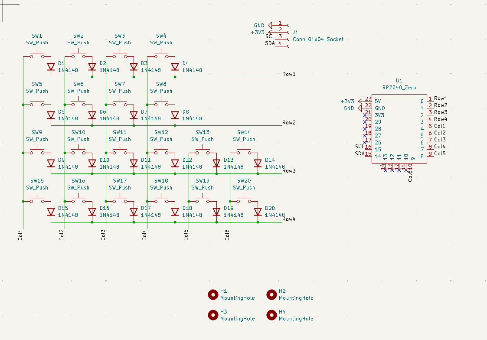
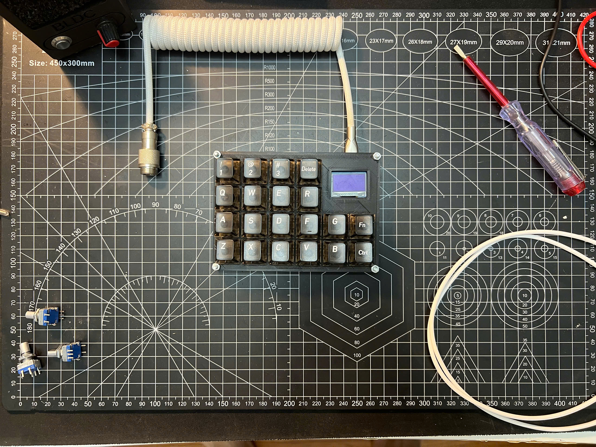

# MonkiiPad20

Hi ! This is a twenty key macropad with a bit of personality. It has an OLED screen, two switchable layers and a pair of animated robot eyes that wake up and look around when you step away. This is also the one board in the family that runs a diode under every switch, which gives it a clean matrix and lets you press keys together without any ghosting.

## The hardware

This pad runs on a Waveshare RP2040-Zero. The reason for that choice is the screen, since the code drives the OLED over the second I2C bus and that dual bus setup is an RP2040 feature. The board is small enough to tuck away neatly, which helps in a build this size.

The switches form a matrix of four rows and six columns, with the rows on pins 0, 1, 2 and 3 and the columns on pins 4, 10, 6, 7, 8 and 9. Twenty of those matrix spots carry keys and the leftover spots stay empty. Every switch has its own diode, so the board reads presses cleanly and handles proper rollover when several keys go down together. Each key is debounced over twenty milliseconds so presses stay crisp.

The display is a 128 by 64 SSD1306 wired to the second I2C bus, with data on pin 14 and clock on pin 15.

## Two ways to build it

There are two roads to a finished MonkiiPad20, and neither one is more correct than the other. You can hand wire the whole thing, or you can order the PCB I designed and solder onto that. Same firmware, same layout, same result. Pick whichever suits your patience and your parts drawer.

### Hand wiring

The scrappy way, and the one I built first. Everything gets soldered point to point, with a diode bridged straight across the legs of each switch and thin wire tying the rows and columns together. The RP2040 and the OLED just get wired in and tucked at the top. It costs almost nothing and you can start tonight, but it is fiddly and the back is a bit of a jungle by the end, so take your time and keep every diode facing the same way.

### The PCB

The tidy way. I laid out a board with a labelled spot for every switch, a diode footprint beside each one and a marked header for the controller and the screen, so there is no loose wire to trace and no guesswork about which pin goes where. You do have to wait for it to ship, but soldering it up is quick and the finished board is far cleaner. The files and full instructions live in the [PCB folder](PCB/), and if you just want to get one made, grab the `MonkiiPad20_PCB.zip` in there and hand that to a fab house as is.

And here is that same board fully populated, switches, diodes and the RP2040-Zero all soldered in! Again, more build photos and the full write up are in the [PCB folder](PCB/).

Before any of that got routed, it started life as a schematic, twenty switches each with their own diode wired into the matrix, along with the OLED header and the RP2040-Zero pinout. The [PCB folder](PCB/) has the full story of how it got from there to a finished board.

## Two layers

The pad boots into a layer called Shortcuter, which is tuned for firing off shortcuts and macros, and you can flip over to a second layer called Typist that types everything straight through. Both layers keep the FN key and the control key in the same spot, so your muscle memory carries over when you switch.

Switching is done with the FN key. Hold it for one full second and the board swaps layers, lets go of anything it was holding so nothing gets stuck down, and refreshes the screen straight away. The FN key sits at row 2 column 5 and the control key sits at row 3 column 5.

## The screen

While you are using the pad the OLED keeps you in the loop. Across the top it prints MONKIIBOARD, in the middle it shows which layer you are on in big letters, either Shortcuter or Typist, and along the bottom it shows the last key you pressed so you always get a little feedback.

## The robot eyes

Leave the pad alone for five seconds and the screen turns into a pair of rounded robot eyes. The pupils glide left and right, and every so often the eyes give a blink, all animated smoothly at around thirty frames a second. Touch any key and the eyes vanish. That first press only wakes the screen back up rather than typing anything, and you are right back on the layer display.

## The special keys

A handful of keys do more than send a letter. The DEL key sends a backspace, the CTRL key holds left control, and the FN key runs the layer switching described above. Everything else on the Shortcuter layer is yours to map to whatever shortcuts you reach for the most.

## What you need to build it

The firmware leans on a few libraries beyond the standard Keyboard one. You will want the Adafruit GFX library and the Adafruit SSD1306 library for the display, plus the Wire library for I2C, and all three install straight from the Arduino library manager. If your editor flags those includes as missing before you install them, that is just the editor and not the code. Flash the sketch with an RP2040 board core selected and you are away.

## The case

The case folder holds the print ready plates for the pad, a top plate and a bottom plate. Slice and print them as they are. Take your time seating the board so the screen lines up cleanly behind the top plate before you close it up.
