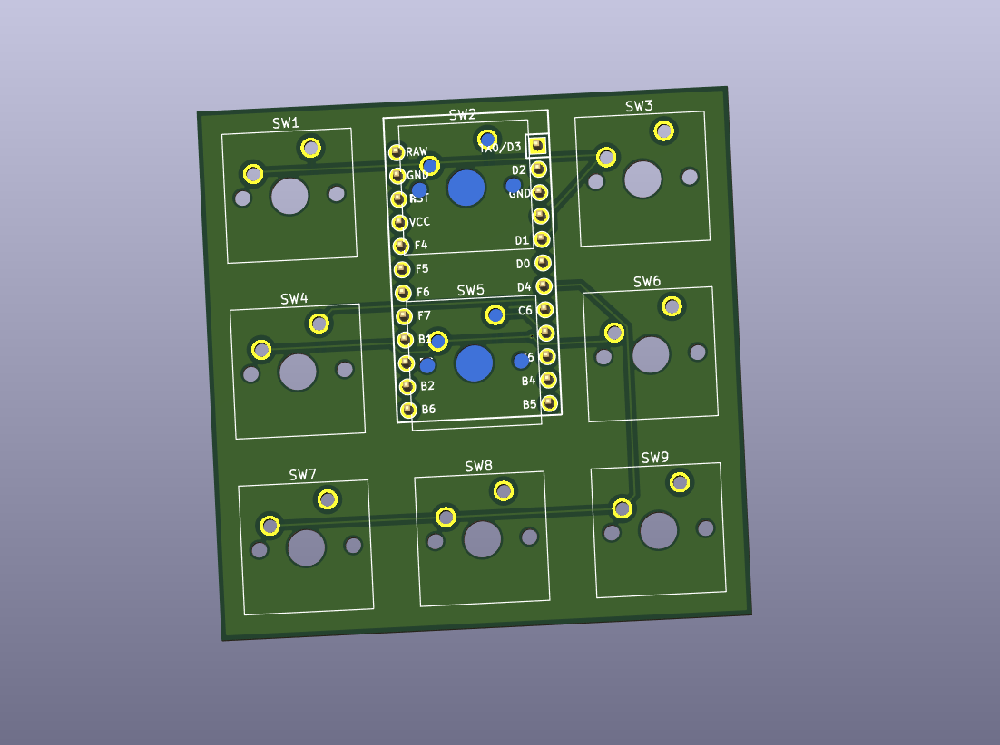
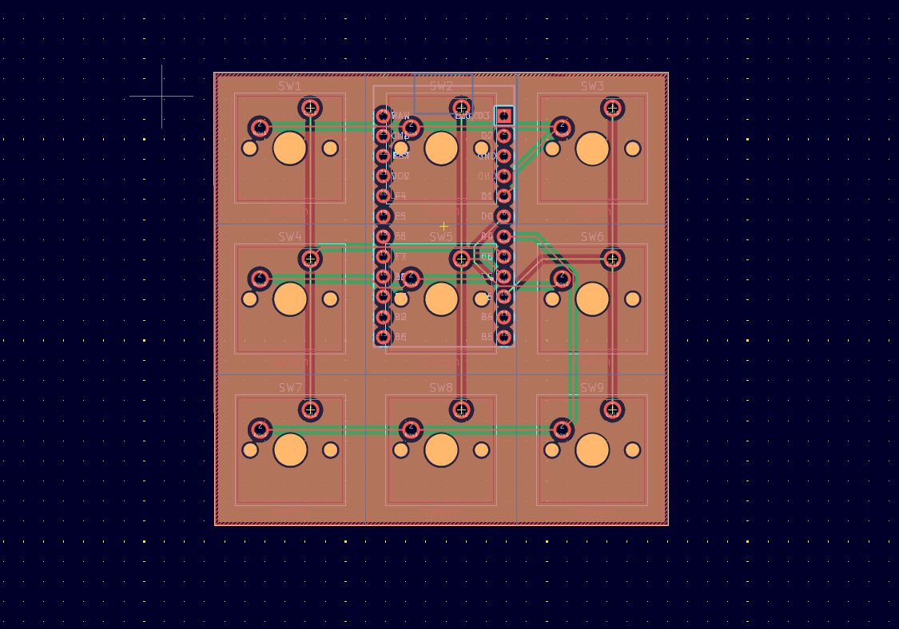
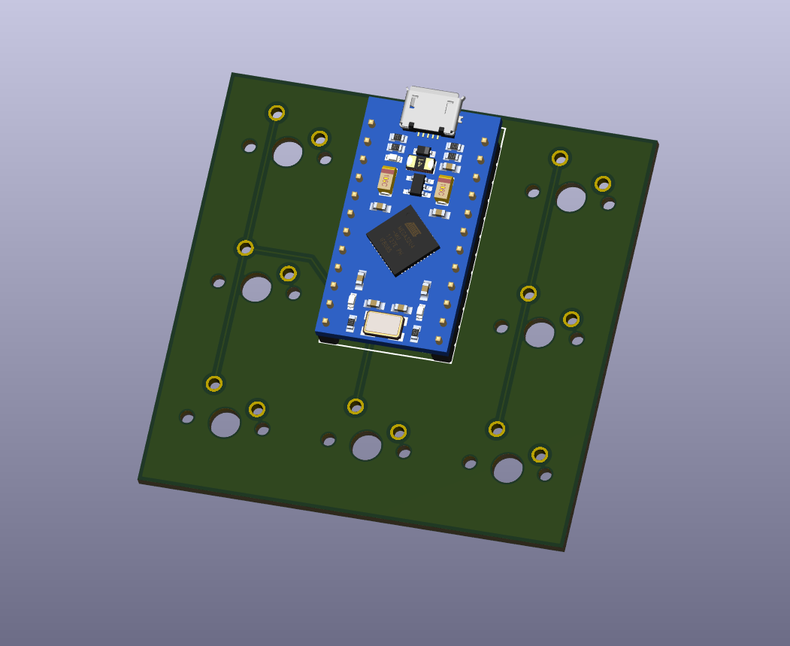

# MonkiiPad3x3 PCB

This is the circuit board I designed for the MonkiiPad3x3. It fits all nine switches and a Pro Micro onto one small board instead of the tangle of wire the original hand wired version needed.

## How I designed it

I drew up a schematic with the nine switches wired straight into a three by three matrix, no diodes, running into the Pro Micro.

From there I laid the switches out around the Pro Micro and routed the rows and columns between them.

Here is the same board with the Pro Micro actually seated on its footprint, USB port and all.

## The switches

All nine switches sit in a three row by three column matrix and there is no diode on this board either. I designed it that way on purpose, same as the MonkiiBoard39. Holding the first key still flips the pad between the plain number pad and the arrow and editing macros, and since that switch is only ever pressed on its own to trigger the toggle, there is nothing here that ever needed true rollover in the first place.

## The pinout

| Signal | Pin |
| --- | --- |
| Row1 | 2 |
| Row2 | 3 |
| Row3 | 4 |
| Col1 | 5 |
| Col2 | 6 |
| Col3 | 7 |

## The controller

The Pro Micro sits right in the middle of the board, taking up roughly the space of two switch footprints, with its USB port lined up against the edge so it stays reachable once the board is in a case.

## Downloading the files

Grab `MonkiiPad3x3_PCB.zip` if you just want this board made. It holds the copper, mask, paste and silkscreen layers for both sides plus the edge cuts and the job file, but I have not exported a drill file for it yet, so pull that from the KiCad project in `KiCad_files` and add it in before you send this off to a fab house.

## What the board is

| Spec | Value |
| --- | --- |
| Layers | 2 |
| Thickness | 1.6 mm |
| Size | 57 by 57 mm |
| Finish | None |

Small enough that shipping costs more than the board itself most of the time.

## Tuning your own PCB

If you want to design or tune your own version of this board, the raw KiCad project sits in `KiCad_files` right next to the gerbers. Download those three files, open the `.kicad_pro` in KiCad, and you get the schematic and the board exactly how we left them. Edit the schematic, move footprints, reroute traces, whatever your build actually needs, then export your own gerbers when you are happy with it.
