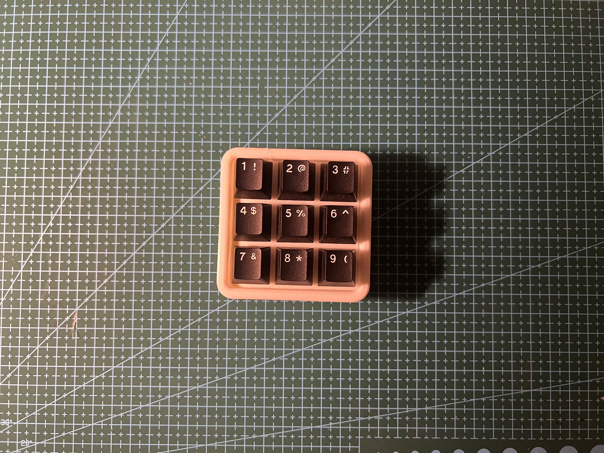
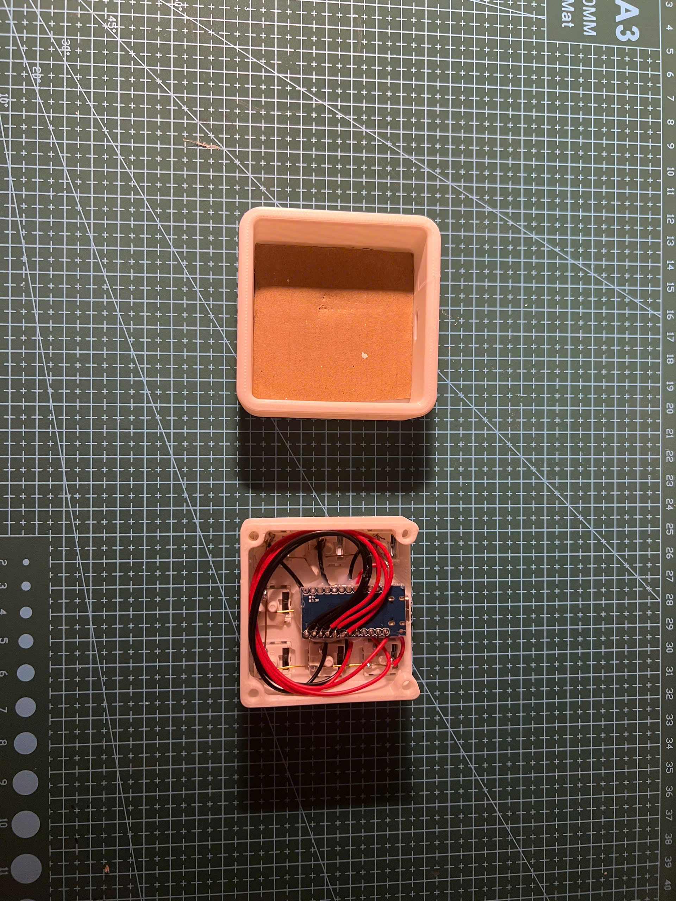
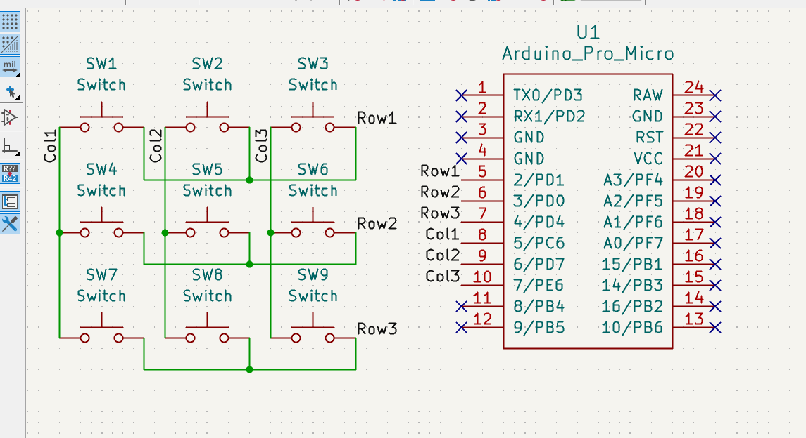
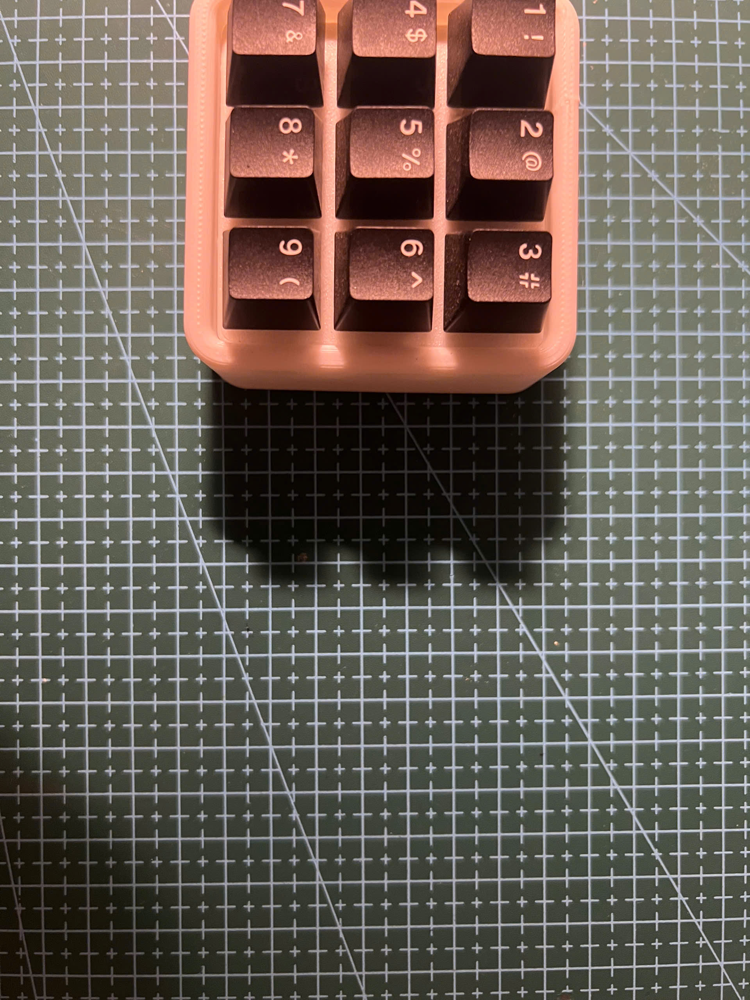

# MonkiiPad3x3

The smallest board in the family, a nine key pad in a simple three by three grid. It is a Pro Micro style board that turns up as an ordinary keyboard, and despite its size it hides a whole second personality behind a long press.

## How it is wired

Nine switches sit in a grid of three rows and three columns. The rows go to pins 2, 3 and 4, and the columns go to pins 5, 6 and 7. Like the MonkiiBoard39 it runs without diodes, so it is built for tapping one key at a time rather than holding a fistful of them down together, which suits a little number pad just fine.

## Two ways to build it

You can hand wire it to the pins above like the original, or order the PCB I designed and solder onto that instead. Same firmware, same pins, no diodes either way.

The design story and the files to get one made live in the [PCB folder](PCB/).

## Two pads in one

Fresh out of the box the pad is a number pad. The nine keys send 1 through 9 laid out exactly how you would picture them, top left down to bottom right.

The top left key is the one to watch. A quick tap sends a 1 like any other key. Hold it down for a second and a half though, and the pad flips into macro mode, and holding it again flips you straight back. It is a neat way to pack twice the function into nine keys without adding a single extra button.

## Macro mode

Once you are in macro mode the layout turns into an editing and navigation cluster. The four keys around the middle become arrow keys, laid out as a cross, with up on the top key and left, down and right across the middle row.

The bottom row becomes editing commands. The bottom left key fires undo, the middle one fires redo, and the bottom right sends delete.

One quick heads up if you go reading the code. The little comments next to those two bottom keys say copy and paste, but what the keys actually send is undo, as control and z, and redo, as control and y. The behavior is the undo and redo pair, the comments just did not keep up with the code.

## The case

The case folder holds the print ready plates for the pad, filed under the VOID9 name. There are a few flavours to pick from. The top comes in a plain flat version and a softer filleted version, and the bottom comes flat or gently angled if you like the pad to sit on a slight tilt. Print whichever top and bottom pair you fancy, then clip the switches into place.

## Flashing it

Open the sketch in the Arduino IDE, choose the Arduino Leonardo or SparkFun Pro Micro board and upload. It only uses the built in Keyboard library, so there is nothing else to install.
