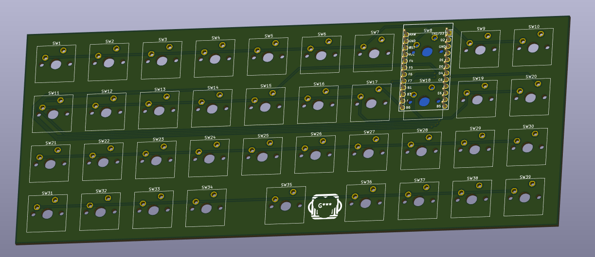
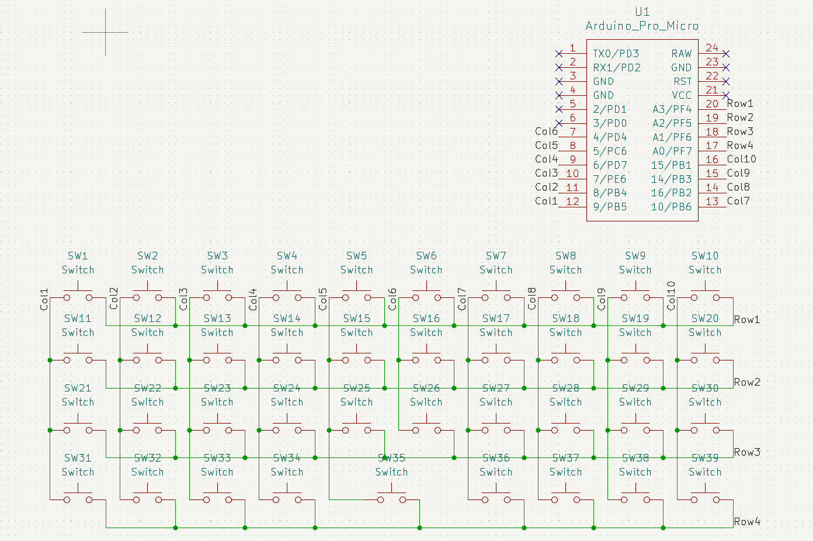
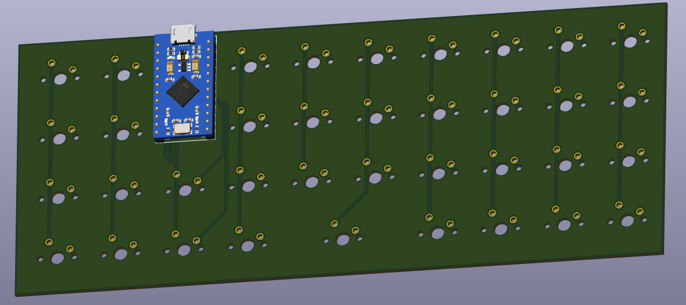
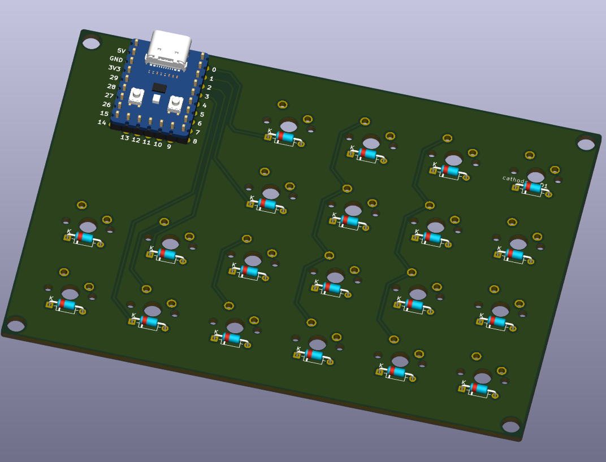
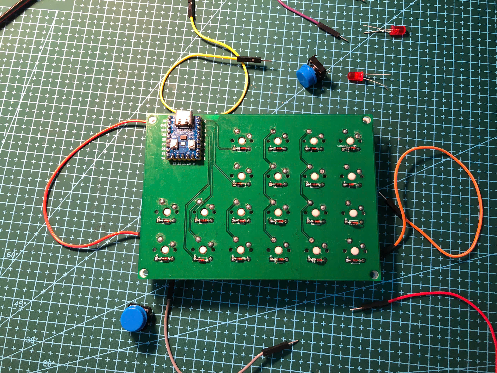

# MonkiiBoard Keyboards

Hi! This is the home for the MonkiiBoard keyboards, an open little family of boards you can build, flash and print yourself. There are four of them so far, and each one lives in its own folder with the Arduino code, a 3D printable case and a readme that walks you through it.

## The boards

MonkiiBoard39 is MonkiiBoard's second build. THis keyboard has thirty nine keys in a tidy ortholinear 40 percent layout, with sticky modifiers on the bottom row and a Windows key that pops the start menu on a double tap.

MonkiiBoard39 has a PCB now too, no diodes on this one since the sticky modifiers never need more than one key held down at a time. The schematic below shows all thirty nine switches wired straight into the matrix, with the Pro Micro footprint sitting right in the middle of the board.

MonkiiPad20 is our first keyboard with a OLED screen implemented. This macropad is a a twenty key macropad with an OLED screen, two switchable layers and a set of animated robot eyes that appear when you stop using it for a while (approximately 6 - 8 seconds). It is also the only board here that uses diodes (so far).

For the MonkiiPad20, we've also made our earliest PCB version 1 for this very macropad (if you choose to go the PCB path instead of the handwiring path)! The image below taken is the PCB, where you can see a silkscreen of our logo, MonkiiBoard, on the front layer.

MonkiiPad3x3 is the first keyboard that we made!! It's a nine key pad that works as a plain number pad until you hold one key (the key "1") to flip it into a macro mode full of arrows and editing shortcuts.

MonkiiPad3x3 got the same treatment, a little PCB with all nine switches and the Pro Micro packed onto one small board, diode free just like MonkiiBoard39.

MonkiiPad16 is our latest macropad, with a knob! This macropad has 16 keys and a rotary encoder, so instead of a second board or a held down FN key you just SPIN the knob to pick a layer, a numpad by default and a page of editing shortcuts one turn away.

## What is in each folder

Every folder is laid out the same way. There is a firmware folder with the Arduino sketch you flash onto the board, a case folder with the print ready STL plates you can drop straight into a slicer, and a readme that covers the wiring, the layout and whatever that particular board likes to do.

## Hand wired or PCB

Every board here except MonkiiPad16 can be built either hand wired or on its PCB, same firmware and the same layout either way. Hand wiring asks a bit more of you on the materials side, thin gauge wire to run the rows and columns, insulating tape to keep the joints from touching each other, and a steadier hand while you solder everything point to point. The PCB skips all of that since the rows and columns are already routed for you, so it comes down to seating the parts and soldering them to the footprint.

| Needed for | Hand wired | PCB |
| --- | --- | --- |
| Soldering station | Yes | Yes |
| Multimeter | Yes | Yes |
| Solder | Yes | Yes |
| Switches | Yes | Yes |
| Controller board | Yes | Yes |
| Thin wire | Yes | No |
| Insulating tape | Yes | No |
| The PCB itself | No | Yes |

MonkiiPad20 is the only board that needs diodes either way, 1N4148s, one for every switch. MonkiiBoard39 and MonkiiPad3x3 skip them completely on both their hand wired and PCB builds.

## A word on diodes

Only MonkiiPad20 has a diode sitting under each switch, which is what gives it a clean matrix and proper rollover. The other two boards skip the diodes to keep the build simple and cheap, so they are at their happiest when you press one or two keys at a time. Worth knowing before you start soldering.

## The PCBs at a glance

Three of the four boards now have a PCB option alongside the hand wired build, all designed in KiCad as two layer boards. Here is how they compare.

| Board | Keys | Matrix | Diodes | Controller | Board size |
| --- | --- | --- | --- | --- | --- |
| MonkiiBoard39 | 39 | 4 by 10 | No | Pro Micro (ATmega32U4) | 195 by 80 mm |
| MonkiiPad20 | 20 | 4 by 6 | Yes | RP2040-Zero | 120 by 86 mm |
| MonkiiPad3x3 | 9 | 3 by 3 | No | Pro Micro (ATmega32U4) | 57 by 57 mm |

Each PCB folder has the full design story, the schematic, the gerbers to get one made, and the raw KiCad project if you want to tune or reroute your own version.

## Getting started

Pick the board you want, open its folder and read through its readme. Wire the matrix to match the pins listed there, flash the sketch from the Arduino IDE, print the plates from the case folder, and you have yourself a keyboard.
