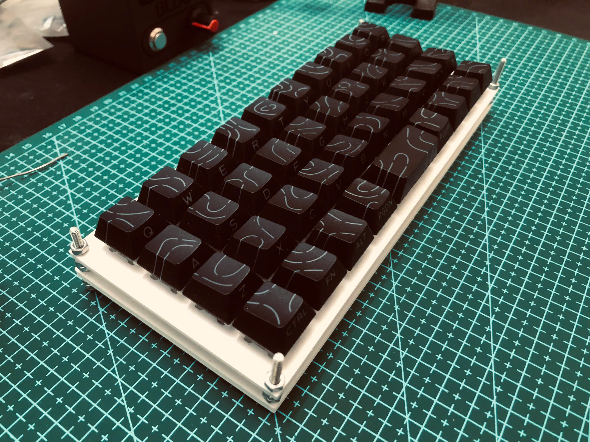

# MonkiiBoard Keyboards

Hi! This is the home for the MonkiiBoard keyboards, an open little family of boards you can build, flash and print yourself. There are four of them so far, and each one lives in its own folder with the Arduino code, a 3D printable case and a readme that walks you through it.

## The boards

MonkiiBoard39 is MonkiiBoard's second build. THis keyboard has thirty nine keys in a tidy ortholinear 40 percent layout, with sticky modifiers on the bottom row and a Windows key that pops the start menu on a double tap.

MonkiiPad20 is our first keyboard with a OLED screen implemented. This macropad is a a twenty key macropad with an OLED screen, two switchable layers and a set of animated robot eyes that appear when you stop using it for a while (approximately 6 - 8 seconds). It is also the only board here that uses diodes (so far).

MonkiiPad3x3 is the first keyboard that we made!! It's a nine key pad that works as a plain number pad until you hold one key (the key "1") to flip it into a macro mode full of arrows and editing shortcuts.

MonkiiPad16 is the newest one. Sixteen keys and a rotary encoder, so instead of a second board or a held down FN key you just spin the knob to pick a layer, a numpad by default and a page of editing shortcuts one turn away.

## What is in each folder

Every folder is laid out the same way. There is a firmware folder with the Arduino sketch you flash onto the board, a case folder with the print ready STL plates you can drop straight into a slicer, and a readme that covers the wiring, the layout and whatever that particular board likes to do.

## A word on diodes

Only MonkiiPad20 has a diode sitting under each switch, which is what gives it a clean matrix and proper rollover. The other two boards skip the diodes to keep the build simple and cheap, so they are at their happiest when you press one or two keys at a time. Worth knowing before you start soldering.

## Getting started

Pick the board you want, open its folder and read through its readme. Wire the matrix to match the pins listed there, flash the sketch from the Arduino IDE, print the plates from the case folder, and you have yourself a keyboard.
